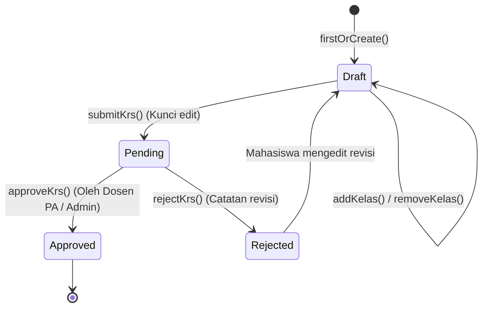

# Product Requirement Document (PRD)
# SIAKAD — Sistem Informasi Akademik STIT Mambaul Hikmah

---

## 1. Dokumen Kontrol & Ringkasan Eksekutif

| Dokumen Info | Detail |
| :--- | :--- |
| **Nama Sistem** | Sistem Informasi Akademik (SIAKAD) STIT Mambaul Hikmah |
| **Institusi** | Sekolah Tinggi Ilmu Tarbiyah (STIT) Mambaul Hikmah |
| **Versi Dokumen** | 1.0.0 (Production Architecture & Requirements) |
| **Status** | Active / Deployed Baseline |
| **Target Pembaca** | AI Coding Agents, Software Architects, Full-stack Developers, QA Engineers, DevOps |
| **Tujuan Dokumen** | Menjadi **Single Source of Truth (SSOT)** arsitektur, basis data, alur bisnis, aturan validasi, dan spesifikasi teknis sehingga AI/developer lain dapat memahami, memelihara, dan mengembangkan sistem tanpa kehilangan konteks. |

---

## 2. Tech Stack & Arsitektur Sistem

Sistem dibangun dengan arsitektur **Service-Repository Pattern** terstruktur berbasis **Monolith MVC Modern** dengan dukungan integrasi LLM (AI) eksternal.

### 2.1 Backend Core
- **Framework**: Laravel 12.x
- **Bahasa**: PHP 8.2+ (direkomendasikan PHP 8.4)
- **Autentikasi & Scaffolding**: Laravel Breeze 2.3 (Session-based auth)
- **Otorisasi (RBAC)**: `spatie/laravel-permission` v6.24
- **Database Engine**:
  - Production: MySQL 8.0+ / MariaDB 10.5+ (atau PostgreSQL 14+)
  - Local/Dev/Testing: SQLite / MySQL
- **Logging & Monitoring**: Laravel Pail 1.2, Custom `activity_log`, Custom `ai_conversation_logs`
- **Code Style & Formatting**: Laravel Pint 1.24 (PSR-12 standard)
- **Unit & Feature Testing**: Pest PHP 4.1 + `pest-plugin-laravel` 4.0

### 2.2 Frontend Stack
- **CSS Framework**: Tailwind CSS v3.x (`@tailwindcss/forms`)
- **JavaScript Micro-Framework**: Alpine.js v3.x (Declarative component state & reactive UI modals)
- **Build Tool**: Vite 7.x (`laravel-vite-plugin` 2.x)
- **HTTP Client**: Axios 1.11 (untuk request AJAX/JSON asynchronous)
- **Layout & Rendering**: Blade Templates dengan Component-based design (`x-app-layout`, `x-modal`, dll.)

### 2.3 AI Integration
- **Default AI Provider**: Qwen API (`Qwen/Qwen3-4B-Instruct-2507`) via HTTP Client atau Google Gemini API (`gemini-2.5-flash-lite`)
- **Fitur AI**: AI Academic Advisor berbasis grounding data riwayat akademik mahasiswa secara real-time dengan Pre-Guard dan Post-Guard verifikasi anti-halusinasi.

### 2.4 Struktur Direktori Kunci
```
siakad/
├── app/
│   ├── Console/Commands/              # Artisan custom commands (e.g. CacheWarmCommand)
│   ├── DTOs/                          # Data Transfer Objects (Dosen, Krs, Mahasiswa)
│   ├── Exceptions/                    # SiakadException, KrsException
│   ├── Helpers/                       # Helper routines
│   ├── Http/
│   │   ├── Controllers/
│   │   │   ├── Admin/                 # 14 Controller Manajemen Akademik & Master Data
│   │   │   ├── Dosen/                 # 10 Controller Penilaian, Presensi, LMS, Bimbingan
│   │   │   ├── Mahasiswa/             # 14 Controller KRS, KHS, Transkrip, LMS, AI Advisor
│   │   │   ├── Auth/                  # Breeze Auth Controllers
│   │   │   ├── HealthController.php   # System & Database health probe (/health)
│   │   │   └── NotificationController.php
│   │   └── Middleware/                # RoleMiddleware, FakultasScopeMiddleware, SecurityHeadersMiddleware, dll.
│   ├── Models/                        # 26 Eloquent Models
│   ├── Repositories/                  # KelasRepository, KrsRepository, NilaiRepository
│   └── Services/                      # KrsService, AkademikCalculationService, AiAdvisorService, CacheService, PresensiService, dll.
├── config/
│   └── siakad.php                     # Aturan SKS, Konversi Nilai, Status KRS, Pagination
├── database/
│   ├── migrations/                    # 38 skema migrasi database
│   └── seeders/                       # DatabaseSeeder, RolePermissionSeeder
├── resources/views/                   # Admin, Dosen, Mahasiswa, Layouts, Components Blade Views
└── routes/
    ├── web.php                        # Root route loader & /dashboard dispatcher
    ├── auth.php, health.php, notification.php, profile.php
    ├── admin/                         # Master data, user, KRS, ruangan, KP, skripsi routes
    ├── dosen/                         # Penilaian, presensi, LMS, bimbingan routes
    └── mahasiswa/                     # KRS, transkrip, jadwal, LMS, AI advisor routes
```

---

## 3. Aktor, Autentikasi & RBAC (Role-Based Access Control)

### 3.1 Identitas Aktor (User Roles)

| Role Code | Nama Peran | Deskripsi Wewenang |
| :--- | :--- | :--- |
| `superadmin` | Super Administrator | Memiliki akses penuh ke seluruh modul, data master, konfigurasi lintas fakultas dan prodi, logs, serta user management. |
| `admin_fakultas` | Admin Fakultas | Administrator yang dibatasi (*scoped*) hanya pada fakultas tertentu (`users.fakultas_id`). Mengelola prodi, mata kuliah, kelas, ruangan, dan monitoring mahasiswa pada fakultasnya. |
| `dosen` | Tenaga Pengajar / Dosen PA | Mengampu kelas, membuat pertemuan & presensi, input nilai perkuliahan, mengunggah materi & tugas LMS, memeriksa tugas, menyetujui/menolak KRS (sebagai Dosen PA), membimbing Skripsi & KP, serta mencatat kehadiran harian. |
| `mahasiswa` | Mahasiswa STIT | Mengisi KRS online, melihat jadwal kuliah, memantau presensi, mengakses materi & mengumpulkan tugas LMS, melihat KHS & Transkrip, mengajukan & menyusun Skripsi/KP, serta berkonsultasi dengan AI Academic Advisor. |

### 3.2 Dispatcher Dashboard
Saat user berhasil login dan mengakses `/dashboard`, sistem menjalankan pemetaan rute otomatis berdasarkan role (`routes/web.php`):
- `superadmin` atau `admin_fakultas` $\rightarrow$ `route('admin.dashboard')`
- `dosen` $\rightarrow$ `route('dosen.dashboard')`
- `mahasiswa` $\rightarrow$ `route('mahasiswa.dashboard')`

### 3.3 Daftar Permission Spatie
Permissions yang didaftarkan di `RolePermissionSeeder`:
- **Mahasiswa**: `view mahasiswa`, `create mahasiswa`, `edit mahasiswa`, `delete mahasiswa`
- **Dosen**: `view dosen`, `create dosen`, `edit dosen`, `delete dosen`
- **Kelas**: `view kelas`, `create kelas`, `edit kelas`, `delete kelas`
- **Mata Kuliah**: `view mata kuliah`, `create mata kuliah`, `edit mata kuliah`, `delete mata kuliah`
- **KRS**: `view krs`, `approve krs`, `reject krs`
- **Nilai**: `view nilai`, `input nilai`
- **Skripsi & KP**: `view skripsi`, `manage skripsi`, `view kp`, `manage kp`
- **Users**: `view users`, `create users`, `edit users`, `delete users`
- **Master Data**: `manage fakultas`, `manage prodi`, `manage tahun akademik`, `manage ruangan`
- **Laporan & Lainnya**: `view reports`, `export reports`, `manage announcements`

### 3.4 Custom Middleware Stack

1. **`RoleMiddleware` (`role:role1,role2`)**:
   - Memvalidasi atribut `$user->role`. Menolak request jika role user tidak ada di dalam daftar yang diizinkan (Response 403: *"Unauthorized. Required role: ..."*).
2. **`FakultasScopeMiddleware` (`fakultas.scope`)**:
   - Menginjeksi scope fakultas pada request untuk `admin_fakultas`. Jika bukan `superadmin`, middleware menyematkan atribut `fakultas_scope = $user->fakultas_id` dan `fakultas_scoped = true` pada `$request`.
3. **`SecurityHeadersMiddleware` (Global)**:
   - Menyematkan header keamanan HTTP pada setiap response:
     - `X-Content-Type-Options: nosniff`
     - `X-Frame-Options: SAMEORIGIN`
     - `X-XSS-Protection: 1; mode=block`
     - `Referrer-Policy: strict-origin-when-cross-origin`
     - `Content-Security-Policy` (disesuaikan untuk asset inline Alpine & Google Fonts)
4. **`RequestLoggingMiddleware` (`log.requests`)**:
   - Mencatat request audit trail ke tabel `activity_log`.
5. **`SemesterAktifMiddleware`**:
   - Memastikan terdapat tahun akademik yang aktif sebelum aksi registrasi/KRS dilakukan.

---

## 4. Skema Basis Data Lengkap (Database Specification)

Berikut adalah daftar lengkap tabel basis data beserta kolom, tipe data, indeks, dan relasinya:

### 4.1 Tabel Users & Autentikasi
```sql
CREATE TABLE users (
    id BIGINT UNSIGNED AUTO_INCREMENT PRIMARY KEY,
    name VARCHAR(255) NOT NULL,
    email VARCHAR(255) NOT NULL UNIQUE,
    email_verified_at TIMESTAMP NULL,
    password VARCHAR(255) NOT NULL,
    role VARCHAR(255) NOT NULL DEFAULT 'mahasiswa', -- 'superadmin', 'admin_fakultas', 'dosen', 'mahasiswa'
    fakultas_id BIGINT UNSIGNED NULL,               -- FK ke fakultas (untuk admin_fakultas)
    remember_token VARCHAR(100) NULL,
    created_at TIMESTAMP NULL,
    updated_at TIMESTAMP NULL,
    FOREIGN KEY (fakultas_id) REFERENCES fakultas(id) ON DELETE SET NULL
);
```

### 4.2 Tabel Master Akademik
```sql
CREATE TABLE fakultas (
    id BIGINT UNSIGNED AUTO_INCREMENT PRIMARY KEY,
    nama VARCHAR(255) NOT NULL,
    kode VARCHAR(50) NULL,
    created_at TIMESTAMP NULL,
    updated_at TIMESTAMP NULL
);

CREATE TABLE prodi (
    id BIGINT UNSIGNED AUTO_INCREMENT PRIMARY KEY,
    nama VARCHAR(255) NOT NULL,
    kode VARCHAR(50) NULL,
    fakultas_id BIGINT UNSIGNED NOT NULL,
    created_at TIMESTAMP NULL,
    updated_at TIMESTAMP NULL,
    FOREIGN KEY (fakultas_id) REFERENCES fakultas(id) ON DELETE CASCADE
);

CREATE TABLE tahun_akademik (
    id BIGINT UNSIGNED AUTO_INCREMENT PRIMARY KEY,
    tahun VARCHAR(20) NOT NULL,         -- e.g. "2024/2025"
    semester VARCHAR(10) NOT NULL,      -- "Ganjil" atau "Genap"
    is_active BOOLEAN NOT NULL DEFAULT 0,
    tanggal_mulai DATE NULL,
    tanggal_selesai DATE NULL,
    created_at TIMESTAMP NULL,
    updated_at TIMESTAMP NULL
);

CREATE TABLE ruangan (
    id BIGINT UNSIGNED AUTO_INCREMENT PRIMARY KEY,
    kode_ruangan VARCHAR(50) NOT NULL UNIQUE,
    nama_ruangan VARCHAR(255) NOT NULL,
    kapasitas INT NOT NULL DEFAULT 40,
    gedung VARCHAR(100) NULL,
    lantai INT NULL,
    fakultas_id BIGINT UNSIGNED NULL,
    created_at TIMESTAMP NULL,
    updated_at TIMESTAMP NULL,
    FOREIGN KEY (fakultas_id) REFERENCES fakultas(id) ON DELETE SET NULL
);

CREATE TABLE mata_kuliah (
    id BIGINT UNSIGNED AUTO_INCREMENT PRIMARY KEY,
    prodi_id BIGINT UNSIGNED NULL,
    kode_mk VARCHAR(50) NOT NULL UNIQUE,
    nama_mk VARCHAR(255) NOT NULL,
    sks INT NOT NULL,
    semester INT NOT NULL,               -- Semester anjuran (1-8)
    created_at TIMESTAMP NULL,
    updated_at TIMESTAMP NULL,
    FOREIGN KEY (prodi_id) REFERENCES prodi(id) ON DELETE SET NULL
);
```

### 4.3 Tabel Profil Mahasiswa & Dosen
```sql
CREATE TABLE dosen (
    id BIGINT UNSIGNED AUTO_INCREMENT PRIMARY KEY,
    user_id BIGINT UNSIGNED NOT NULL UNIQUE,
    nidn VARCHAR(50) NOT NULL UNIQUE,
    prodi_id BIGINT UNSIGNED NULL,
    created_at TIMESTAMP NULL,
    updated_at TIMESTAMP NULL,
    FOREIGN KEY (user_id) REFERENCES users(id) ON DELETE CASCADE,
    FOREIGN KEY (prodi_id) REFERENCES prodi(id) ON DELETE SET NULL
);

CREATE TABLE mahasiswa (
    id BIGINT UNSIGNED AUTO_INCREMENT PRIMARY KEY,
    user_id BIGINT UNSIGNED NOT NULL UNIQUE,
    nim VARCHAR(50) NOT NULL UNIQUE,
    prodi_id BIGINT UNSIGNED NOT NULL,
    dosen_pa_id BIGINT UNSIGNED NULL,    -- FK ke dosen (Dosen Pembimbing Akademik)
    angkatan VARCHAR(10) NOT NULL,
    status ENUM('aktif', 'cuti', 'do', 'lulus') NOT NULL DEFAULT 'aktif',
    created_at TIMESTAMP NULL,
    updated_at TIMESTAMP NULL,
    FOREIGN KEY (user_id) REFERENCES users(id) ON DELETE CASCADE,
    FOREIGN KEY (prodi_id) REFERENCES prodi(id) ON DELETE CASCADE,
    FOREIGN KEY (dosen_pa_id) REFERENCES dosen(id) ON DELETE SET NULL
);
```

### 4.4 Tabel Kelas & Jadwal Kuliah
```sql
CREATE TABLE kelas (
    id BIGINT UNSIGNED AUTO_INCREMENT PRIMARY KEY,
    mata_kuliah_id BIGINT UNSIGNED NOT NULL,
    dosen_id BIGINT UNSIGNED NOT NULL,
    tahun_akademik_id BIGINT UNSIGNED NULL,
    nama_kelas VARCHAR(50) NOT NULL,      -- e.g. "TI-A", "PAI-1"
    kapasitas INT NOT NULL DEFAULT 40,
    is_closed BOOLEAN NOT NULL DEFAULT 0,
    created_at TIMESTAMP NULL,
    updated_at TIMESTAMP NULL,
    FOREIGN KEY (mata_kuliah_id) REFERENCES mata_kuliah(id) ON DELETE CASCADE,
    FOREIGN KEY (dosen_id) REFERENCES dosen(id) ON DELETE CASCADE,
    FOREIGN KEY (tahun_akademik_id) REFERENCES tahun_akademik(id) ON DELETE SET NULL
);

CREATE TABLE jadwal_kuliah (
    id BIGINT UNSIGNED AUTO_INCREMENT PRIMARY KEY,
    kelas_id BIGINT UNSIGNED NOT NULL,
    ruangan_id BIGINT UNSIGNED NULL,
    hari INT NOT NULL,                   -- 0: Minggu, 1: Senin, 2: Selasa, s/d 6: Sabtu
    jam_mulai TIME NOT NULL,
    jam_selesai TIME NOT NULL,
    created_at TIMESTAMP NULL,
    updated_at TIMESTAMP NULL,
    FOREIGN KEY (kelas_id) REFERENCES kelas(id) ON DELETE CASCADE,
    FOREIGN KEY (ruangan_id) REFERENCES ruangan(id) ON DELETE SET NULL
);
```

### 4.5 Tabel KRS & Nilai Mahasiswa
```sql
CREATE TABLE krs (
    id BIGINT UNSIGNED AUTO_INCREMENT PRIMARY KEY,
    mahasiswa_id BIGINT UNSIGNED NOT NULL,
    tahun_akademik_id BIGINT UNSIGNED NOT NULL,
    status ENUM('draft', 'pending', 'approved', 'rejected') NOT NULL DEFAULT 'draft',
    catatan TEXT NULL,                   -- Catatan revisi jika ditolak oleh Dosen PA
    created_at TIMESTAMP NULL,
    updated_at TIMESTAMP NULL,
    UNIQUE KEY krs_mahasiswa_tahun_unique (mahasiswa_id, tahun_akademik_id),
    FOREIGN KEY (mahasiswa_id) REFERENCES mahasiswa(id) ON DELETE CASCADE,
    FOREIGN KEY (tahun_akademik_id) REFERENCES tahun_akademik(id) ON DELETE CASCADE
);

CREATE TABLE krs_detail (
    id BIGINT UNSIGNED AUTO_INCREMENT PRIMARY KEY,
    krs_id BIGINT UNSIGNED NOT NULL,
    kelas_id BIGINT UNSIGNED NOT NULL,
    created_at TIMESTAMP NULL,
    updated_at TIMESTAMP NULL,
    UNIQUE KEY krs_detail_krs_kelas_unique (krs_id, kelas_id),
    FOREIGN KEY (krs_id) REFERENCES krs(id) ON DELETE CASCADE,
    FOREIGN KEY (kelas_id) REFERENCES kelas(id) ON DELETE CASCADE
);

CREATE TABLE nilai (
    id BIGINT UNSIGNED AUTO_INCREMENT PRIMARY KEY,
    mahasiswa_id BIGINT UNSIGNED NOT NULL,
    kelas_id BIGINT UNSIGNED NOT NULL,
    nilai_angka DECIMAL(5,2) NULL,        -- Range: 0.00 - 100.00
    nilai_huruf VARCHAR(5) NULL,          -- 'A', 'A-', 'B+', 'B', 'C+', 'C', 'D', 'E'
    created_at TIMESTAMP NULL,
    updated_at TIMESTAMP NULL,
    UNIQUE KEY nilai_mahasiswa_kelas_unique (mahasiswa_id, kelas_id),
    FOREIGN KEY (mahasiswa_id) REFERENCES mahasiswa(id) ON DELETE CASCADE,
    FOREIGN KEY (kelas_id) REFERENCES kelas(id) ON DELETE CASCADE
);
```

### 4.6 Tabel Pertemuan & Presensi (Kehadiran Mahasiswa & Dosen)
```sql
CREATE TABLE pertemuan (
    id BIGINT UNSIGNED AUTO_INCREMENT PRIMARY KEY,
    jadwal_kuliah_id BIGINT UNSIGNED NOT NULL,
    pertemuan_ke INT NOT NULL,           -- Range 1 - 16
    tanggal DATE NOT NULL,
    materi VARCHAR(255) NULL,
    status ENUM('terjadwal', 'selesai', 'batal') NOT NULL DEFAULT 'terjadwal',
    created_at TIMESTAMP NULL,
    updated_at TIMESTAMP NULL,
    FOREIGN KEY (jadwal_kuliah_id) REFERENCES jadwal_kuliah(id) ON DELETE CASCADE
);

CREATE TABLE presensi (
    id BIGINT UNSIGNED AUTO_INCREMENT PRIMARY KEY,
    pertemuan_id BIGINT UNSIGNED NOT NULL,
    mahasiswa_id BIGINT UNSIGNED NOT NULL,
    status ENUM('Hadir', 'Sakit', 'Izin', 'Alpa') NOT NULL DEFAULT 'Alpa',
    keterangan VARCHAR(255) NULL,
    created_at TIMESTAMP NULL,
    updated_at TIMESTAMP NULL,
    UNIQUE KEY presensi_pertemuan_mhs_unique (pertemuan_id, mahasiswa_id),
    FOREIGN KEY (pertemuan_id) REFERENCES pertemuan(id) ON DELETE CASCADE,
    FOREIGN KEY (mahasiswa_id) REFERENCES mahasiswa(id) ON DELETE CASCADE
);

CREATE TABLE kehadiran_dosen (
    id BIGINT UNSIGNED AUTO_INCREMENT PRIMARY KEY,
    dosen_id BIGINT UNSIGNED NOT NULL,
    jadwal_kuliah_id BIGINT UNSIGNED NOT NULL,
    tanggal DATE NOT NULL,
    jam_masuk TIME NULL,
    jam_keluar TIME NULL,
    status ENUM('hadir', 'izin', 'sakit', 'alpa') NOT NULL DEFAULT 'hadir',
    keterangan TEXT NULL,
    created_at TIMESTAMP NULL,
    updated_at TIMESTAMP NULL,
    FOREIGN KEY (dosen_id) REFERENCES dosen(id) ON DELETE CASCADE,
    FOREIGN KEY (jadwal_kuliah_id) REFERENCES jadwal_kuliah(id) ON DELETE CASCADE
);
```

### 4.7 Tabel LMS (Materi, Tugas, Submission)
```sql
CREATE TABLE materi (
    id BIGINT UNSIGNED AUTO_INCREMENT PRIMARY KEY,
    pertemuan_id BIGINT UNSIGNED NOT NULL,
    judul VARCHAR(255) NOT NULL,
    deskripsi TEXT NULL,
    file_path VARCHAR(255) NULL,
    file_name VARCHAR(255) NULL,
    file_size INT NULL,
    file_type VARCHAR(100) NULL,
    link_external VARCHAR(500) NULL,
    urutan INT NOT NULL DEFAULT 1,
    created_at TIMESTAMP NULL,
    updated_at TIMESTAMP NULL,
    FOREIGN KEY (pertemuan_id) REFERENCES pertemuan(id) ON DELETE CASCADE
);

CREATE TABLE tugas (
    id BIGINT UNSIGNED AUTO_INCREMENT PRIMARY KEY,
    kelas_id BIGINT UNSIGNED NOT NULL,
    judul VARCHAR(255) NOT NULL,
    deskripsi TEXT NULL,
    deadline DATETIME NOT NULL,
    file_tugas VARCHAR(255) NULL,
    allowed_extensions VARCHAR(255) NOT NULL DEFAULT 'pdf,doc,docx,zip,rar',
    created_at TIMESTAMP NULL,
    updated_at TIMESTAMP NULL,
    FOREIGN KEY (kelas_id) REFERENCES kelas(id) ON DELETE CASCADE
);

CREATE TABLE tugas_submission (
    id BIGINT UNSIGNED AUTO_INCREMENT PRIMARY KEY,
    tugas_id BIGINT UNSIGNED NOT NULL,
    mahasiswa_id BIGINT UNSIGNED NOT NULL,
    file_submission VARCHAR(255) NOT NULL,
    catatan TEXT NULL,
    submitted_at DATETIME NOT NULL,
    nilai DECIMAL(5,2) NULL,
    feedback TEXT NULL,
    graded_at DATETIME NULL,
    created_at TIMESTAMP NULL,
    updated_at TIMESTAMP NULL,
    FOREIGN KEY (tugas_id) REFERENCES tugas(id) ON DELETE CASCADE,
    FOREIGN KEY (mahasiswa_id) REFERENCES mahasiswa(id) ON DELETE CASCADE
);
```

### 4.8 Tabel Tugas Akhir (Skripsi) & Kerja Praktek (KP)
```sql
CREATE TABLE skripsi (
    id BIGINT UNSIGNED AUTO_INCREMENT PRIMARY KEY,
    mahasiswa_id BIGINT UNSIGNED NOT NULL,
    pembimbing1_id BIGINT UNSIGNED NULL,
    pembimbing2_id BIGINT UNSIGNED NULL,
    judul VARCHAR(500) NOT NULL,
    abstrak TEXT NULL,
    bidang_kajian VARCHAR(100) NULL,
    status ENUM(
        'pengajuan', 'review', 'ditolak', 'diterima', 'bimbingan', 
        'seminar_proposal', 'penelitian', 'seminar_hasil', 'sidang', 
        'revisi', 'selesai'
    ) NOT NULL DEFAULT 'pengajuan',
    tanggal_pengajuan DATE NOT NULL,
    tanggal_acc_judul DATE NULL,
    tanggal_seminar_proposal DATE NULL,
    tanggal_seminar_hasil DATE NULL,
    tanggal_sidang DATE NULL,
    tanggal_selesai DATE NULL,
    nilai_akhir DECIMAL(5,2) NULL,
    nilai_huruf VARCHAR(5) NULL,
    catatan_admin TEXT NULL,
    created_at TIMESTAMP NULL,
    updated_at TIMESTAMP NULL,
    FOREIGN KEY (mahasiswa_id) REFERENCES mahasiswa(id) ON DELETE CASCADE,
    FOREIGN KEY (pembimbing1_id) REFERENCES dosen(id) ON DELETE SET NULL,
    FOREIGN KEY (pembimbing2_id) REFERENCES dosen(id) ON DELETE SET NULL
);

CREATE TABLE bimbingan_skripsi (
    id BIGINT UNSIGNED AUTO_INCREMENT PRIMARY KEY,
    skripsi_id BIGINT UNSIGNED NOT NULL,
    dosen_id BIGINT UNSIGNED NOT NULL,
    tanggal DATE NOT NULL,
    bab_pembahasan VARCHAR(100) NOT NULL,
    catatan_dosen TEXT NOT NULL,
    catatan_mahasiswa TEXT NULL,
    status ENUM('pending', 'revisi', 'acc') NOT NULL DEFAULT 'pending',
    file_draft VARCHAR(255) NULL,
    created_at TIMESTAMP NULL,
    updated_at TIMESTAMP NULL,
    FOREIGN KEY (skripsi_id) REFERENCES skripsi(id) ON DELETE CASCADE,
    FOREIGN KEY (dosen_id) REFERENCES dosen(id) ON DELETE CASCADE
);

CREATE TABLE kerja_praktek (
    id BIGINT UNSIGNED AUTO_INCREMENT PRIMARY KEY,
    mahasiswa_id BIGINT UNSIGNED NOT NULL,
    pembimbing_id BIGINT UNSIGNED NULL,
    nama_perusahaan VARCHAR(255) NOT NULL,
    alamat_perusahaan TEXT NOT NULL,
    bidang_usaha VARCHAR(100) NULL,
    nama_pembimbing_lapangan VARCHAR(255) NULL,
    jabatan_pembimbing_lapangan VARCHAR(100) NULL,
    no_telp_pembimbing VARCHAR(50) NULL,
    tanggal_mulai DATE NOT NULL,
    tanggal_selesai DATE NOT NULL,
    judul_laporan VARCHAR(500) NULL,
    status ENUM(
        'pengajuan', 'disetujui', 'ditolak', 'berlangsung', 
        'selesai_kp', 'penyusunan_laporan', 'seminar', 'revisi', 'selesai'
    ) NOT NULL DEFAULT 'pengajuan',
    tanggal_seminar DATE NULL,
    nilai_perusahaan DECIMAL(5,2) NULL,
    nilai_pembimbing DECIMAL(5,2) NULL,
    nilai_seminar DECIMAL(5,2) NULL,
    nilai_akhir DECIMAL(5,2) NULL,
    nilai_huruf VARCHAR(5) NULL,
    catatan TEXT NULL,
    created_at TIMESTAMP NULL,
    updated_at TIMESTAMP NULL,
    FOREIGN KEY (mahasiswa_id) REFERENCES mahasiswa(id) ON DELETE CASCADE,
    FOREIGN KEY (pembimbing_id) REFERENCES dosen(id) ON DELETE SET NULL
);

CREATE TABLE logbook_kp (
    id BIGINT UNSIGNED AUTO_INCREMENT PRIMARY KEY,
    kerja_praktek_id BIGINT UNSIGNED NOT NULL,
    tanggal DATE NOT NULL,
    kegiatan TEXT NOT NULL,
    hasil TEXT NULL,
    status_verifikasi ENUM('pending', 'disetujui', 'ditolak') NOT NULL DEFAULT 'pending',
    catatan_pembimbing TEXT NULL,
    file_dokumentasi VARCHAR(255) NULL,
    created_at TIMESTAMP NULL,
    updated_at TIMESTAMP NULL,
    FOREIGN KEY (kerja_praktek_id) REFERENCES kerja_praktek(id) ON DELETE CASCADE
);
```

### 4.9 Tabel AI, Notifikasi, Audit & Log
```sql
CREATE TABLE ai_conversation_logs (
    id BIGINT UNSIGNED AUTO_INCREMENT PRIMARY KEY,
    mahasiswa_id BIGINT UNSIGNED NOT NULL,
    message TEXT NOT NULL,
    response MEDIUMTEXT NOT NULL,
    model VARCHAR(100) NOT NULL,
    tokens_used INT NULL,
    response_time_ms INT NULL,
    guard_applied BOOLEAN NOT NULL DEFAULT 0,
    guard_issues JSON NULL,
    created_at TIMESTAMP NULL,
    updated_at TIMESTAMP NULL,
    FOREIGN KEY (mahasiswa_id) REFERENCES mahasiswa(id) ON DELETE CASCADE
);

CREATE TABLE notifications (
    id BIGINT UNSIGNED AUTO_INCREMENT PRIMARY KEY,
    user_id BIGINT UNSIGNED NOT NULL,
    type VARCHAR(50) NOT NULL,            -- e.g. 'krs_approved', 'nilai_submitted'
    title VARCHAR(255) NOT NULL,
    message TEXT NOT NULL,
    data JSON NULL,
    is_read BOOLEAN NOT NULL DEFAULT 0,
    created_at TIMESTAMP NULL,
    updated_at TIMESTAMP NULL,
    FOREIGN KEY (user_id) REFERENCES users(id) ON DELETE CASCADE
);

CREATE TABLE activity_log (
    id BIGINT UNSIGNED AUTO_INCREMENT PRIMARY KEY,
    user_id BIGINT UNSIGNED NULL,
    action VARCHAR(255) NOT NULL,
    description TEXT NULL,
    ip_address VARCHAR(45) NULL,
    user_agent TEXT NULL,
    created_at TIMESTAMP NULL,
    updated_at TIMESTAMP NULL,
    FOREIGN KEY (user_id) REFERENCES users(id) ON DELETE SET NULL
);
```

---

## 5. Aturan Bisnis & Logika Akademik (Core Logic)

### 5.1 Penentuan Batas Maksimal SKS Mahasiswa
Batas pengambilan SKS semester dihitung dinamis oleh `KrsService::getMaxSksForMahasiswa()` melalui `AkademikCalculationService::getMaxSKS()`.

1. **Mahasiswa Baru (Semester 1 / Belum Ada IPS)**:
   - Diberikan kuota default: **24 SKS** (`config('siakad.maks_sks.default')`).
2. **Mahasiswa Semester $\ge 2$**:
   - Dihitung berdasarkan **IPS (Indeks Prestasi Semester) terakhir** yang telah disetujui dan dinilai:
     | Range IPS Semester Lalu | Batas Maksimal SKS Baru |
     | :--- | :--- |
     | $3.51 \le \text{IPS} \le 4.00$ | **24 SKS** |
     | $3.01 \le \text{IPS} \le 3.50$ | **22 SKS** |
     | $2.51 \le \text{IPS} \le 3.00$ | **20 SKS** |
     | $2.00 \le \text{IPS} \le 2.50$ | **18 SKS** |
     | $0.00 \le \text{IPS} \le 1.99$ | **14 SKS** |

### 5.2 Konversi Nilai Angka ke Nilai Huruf & Bobot
Sesuai konfigurasi `config('siakad.nilai_konversi')` yang diproses oleh `PenilaianService`:

| Range Nilai Angka | Nilai Huruf | Bobot Nilai ($B_i$) | Keterangan Kelulusan |
| :---: | :---: | :---: | :---: |
| $85.00 - 100.00$ | **A** | 4.00 | Sangat Memuaskan |
| $80.00 - 84.99$ | **A-** | 3.75 | Memuaskan |
| $75.00 - 79.99$ | **B+** | 3.50 | Sangat Baik |
| $70.00 - 74.99$ | **B** | 3.00 | Baik |
| $65.00 - 69.99$ | **C+** | 2.50 | Cukup Baik |
| $60.00 - 64.99$ | **C** | 2.00 | Cukup |
| $55.00 - 59.99$ | **D** | 1.00 | Kurang |
| $0.00 - 54.99$ | **E** | 0.00 | Gagal / Tidak Lulus |

### 5.3 Formula Perhitungan IPS & IPK
Dijalankan oleh `AkademikCalculationService`:

$$\text{IPS} = \frac{\sum_{i=1}^{n} (\text{SKS}_i \times \text{Bobot}_i)}{\sum_{i=1}^{n} \text{SKS}_i}$$
*(Dihitung per semester aktif / terpilih).*

$$\text{IPK} = \frac{\sum_{j=1}^{m} (\text{SKS}_j \times \text{Bobot}_j)}{\sum_{j=1}^{m} \text{SKS}_j}$$
*(Dihitung kumulatif dari seluruh mata kuliah yang telah diselesaikan).*

### 5.4 Siklus Hidup & Aturan Validasi KRS (KrsService)



**Aturan Ketat KRS:**
1. Mahasiswa hanya dapat menambah/menghapus kelas jika status KRS bernilai `draft`.
2. **Pengecekan Kapasitas**: Jumlah mahasiswa di `krs_detail` untuk kelas tersebut tidak boleh melampaui `kelas.kapasitas`. Jika penuh, throw `KrsException::classFull()`.
3. **Pencegahan Mata Kuliah Ganda**: Mahasiswa tidak boleh mengambil 2 kelas yang menginduk pada mata kuliah yang sama di satu KRS. Jika terdeteksi, throw `KrsException::courseAlreadyTaken()`.
4. **Pengecekan Plafon SKS**: $\text{Total SKS Saat Ini} + \text{SKS Kelas Baru} \le \text{Batas Maksimal SKS}$. Jika melebihi, throw `KrsException::sksLimitExceeded()`.
5. **Pencegahan KRS Kosong**: Mahasiswa tidak dapat melakukan `submitKrs()` jika tidak ada satupun kelas yang diambil (`KrsException::emptyKrs()`).

---

## 6. Spesifikasi Modul Sistem

### 6.1 Modul Master Data & Administrasi (Admin)
- **Fakultas & Prodi**: CRUD fakultas dan program studi.
- **Tahun Akademik**: Menentukan semester aktif (`is_active = true`). Hanya satu tahun akademik yang boleh aktif dalam satu waktu.
- **Ruangan**: Pengaturan kode ruang, gedung, lantai, dan kapasitas tempat duduk.
- **Mata Kuliah**: Menentukan kode MK, nama MK, SKS, dan semester paket.
- **Kelas & Penjadwalan**: Membuat rombongan belajar (A, B, dll.), menugaskan dosen pengampu, menetapkan ruangan, hari (0=Minggu s/d 6=Sabtu), dan jam mulai/selesai.
- **User Management**: Manajemen akun Dosen, Mahasiswa, Admin Fakultas, dan reset password.
- **KRS Approval Oversight**: Admin memiliki kapabilitas melihat dan memonitor status KRS di level fakultas atau universitas.

### 6.2 Modul Perkuliahan & Presensi (Dosen & Mahasiswa)
- **Pertemuan Kelas**: Dosen membuat pertemuan (pertemuan ke-1 s/d ke-16) per jadwal kuliah dengan topik bahasan materi.
- **Presensi Mahasiswa**: Dosen mengisi kehadiran mahasiswa dengan status (`Hadir`, `Sakit`, `Izin`, `Alpa`). Mahasiswa memantau riwayat presensi dan persentase kehadiran per mata kuliah.
- **Kehadiran Dosen**: Dosen mencatat *Check-In* jam masuk dan *Check-Out* jam keluar perkuliahan harian. Admin dapat merekap kehadiran seluruh dosen.

### 6.3 Modul LMS (E-Learning Mini)
- **Materi Kuliah**:
  - Dosen mengunggah materi berbasis pertemuan (PDF, PPT, DOCX) maksimal 20 MB atau menyematkan URL eksternal (YouTube, Google Drive).
  - Mahasiswa mengunduh materi langsung dari portal.
- **Tugas Kuliah**:
  - Dosen membuat penugasan dengan tenggat waktu (*deadline*) dan pembatasan ekstensi file.
  - Mahasiswa mengunggah file jawaban tugas (maksimal 10 MB) sebelum deadline.
  - Dosen memberikan penilaian (0-100) dan catatan feedback secara langsung.

### 6.4 Modul Penilaian & Cetak Dokumen
- **Bulk Input Nilai**: Dosen menginput nilai angka mahasiswa sekelas dalam satu form tabular (AJAX atau direct submit). Sistem otomatis mengonversi ke nilai huruf dan bobot.
- **Cetak KHS**: Kartu Hasil Studi per semester yang diexport ke format HTML *print-ready* (support Ctrl+P/Save to PDF) dilengkapi tanda tangan Dosen PA dan pejabat akademik.
- **Cetak Transkrip**: Transkrip akademik kumulatif lengkap dengan distribusi nilai (A, B, C, D, E), total SKS lulus, dan IPK kumulatif.

### 6.5 Modul Skripsi & Kerja Praktek
- **Skripsi**:
  - 11 tahapan status dari pengajuan judul, verifikasi admin, penunjukan Pembimbing 1 & 2, log bimbingan berkala, seminar proposal, penelitian, seminar hasil, sidang meja hijau, hingga revisi dan penetapan nilai akhir.
- **Kerja Praktek (KP)**:
  - Pendaftaran tempat magang/instansi, pembimbing lapangan, penunjukan dosen pembimbing KP, pengisian logbook harian oleh mahasiswa, verifikasi oleh dosen, serta penggabungan 3 komponen nilai: Nilai Instansi + Nilai Pembimbing + Nilai Seminar.

---

## 7. Deep-Dive: AI Academic Advisor

SIAKAD STIT Mambaul Hikmah dilengkapi asisten cerdas akademik berbasis LLM yang didesain khusus agar **tidak pernah berhalusinasi** dan hanya menjawab berdasarkan data riil mahasiswa.

### 7.1 Alur Kerja AI Advisor
```
Mahasiswa Input Chat 
      │
      ▼
AdvisorContextBuilder.php ──► Mengambil Biodata, IPK, SKS Lulus, Riwayat Nilai, 
                              Daftar MK Kurikulum yang Belum Diambil, & Batas SKS
      │
      ▼
AdvisorGuards.php (Pre-Guards) ──► Validasi integritas konteks mahasiswa
      │
      ▼
AiAdvisorService.php ──► Menembak Qwen API / Google Gemini dengan System Prompt Ketat
      │
      ▼
AdvisorGuards.php (Post-Guards) 
      ├─► Cek 1: Apakah AI menyarankan kode MK yang tidak ada di kurikulum?
      ├─► Cek 2: Apakah AI salah menyebutkan IPK/SKS mahasiswa?
      ├─► Cek 3: Apakah rekomendasi SKS melebihi plafon IPS?
      │
      ├── [LOLOS] ──► Simpan ke ai_conversation_logs ──► Tampilkan ke Mahasiswa
      │
      └── [GAGAL] ──► Retry dengan Guard Prompt ATAU Kembalikan Template Fallback
```

### 7.2 Fitur Pengaman (Guards)
1. **`AdvisorContextBuilder`**:
   - Membangun *ground truth* data akademik: NIM, Prodi, Semester, IPK saat ini, riwayat nilai (mata kuliah yang lulus dan mengulang), serta daftar mata kuliah yang tersedia di semester depan.
2. **`AdvisorGuards` (Pre & Post)**:
   - Mendeteksi pelanggaran halusinasi nama mata kuliah. Jika LLM menyarankan mata kuliah fiktif yang tidak ada dalam kurikulum prodi, post-guard langsung mencegat respons tersebut.
   - Menyediakan mekanisme retry otomatis (`MAX_RETRIES = 1`) dengan injeksi instruksi koreksi jika terjadi *guard violation*.
3. **Audit Log `ai_conversation_logs`**:
   - Menyimpan seluruh prompt, respons, waktu pemrosesan (`response_time_ms`), token, dan status pelanggaran guard (`guard_applied`, `guard_issues`).

---

## 8. Inventori Endpoint & Routing

Sistem menggunakan rute web terstruktur yang dikelompokkan berdasarkan peran dan fungsi:

### 8.1 Public & Autentikasi
| Method | URI | Action / Controller | Deskripsi |
| :--- | :--- | :--- | :--- |
| `GET` | `/` | Closure | Redirect ke `/login` |
| `GET` | `/login` | `AuthenticatedSessionController@create` | Form login |
| `POST` | `/login` | `AuthenticatedSessionController@store` | Proses autentikasi (Rate-limited) |
| `POST` | `/logout` | `AuthenticatedSessionController@destroy` | Logout sesi user |
| `GET` | `/health` | `HealthController@index` | Health check DB & status server |
| `GET` | `/dashboard` | Closure | Redirect sesuai peran user |

### 8.2 Endpoint Mahasiswa (`prefix: /mahasiswa`, `middleware: ['auth', 'role:mahasiswa']`)
| Method | URI | Controller Action | Fungsi |
| :--- | :--- | :--- | :--- |
| `GET` | `/mahasiswa/dashboard` | `Mahasiswa\DashboardController@index` | Dashboard mahasiswa & overview |
| `GET` | `/mahasiswa/biodata` | `Mahasiswa\BiodataController@index` | Profil & data diri mahasiswa |
| `GET` | `/mahasiswa/jadwal` | `Mahasiswa\JadwalController@index` | Jadwal perkuliahan mingguan |
| `GET` | `/mahasiswa/presensi` | `Mahasiswa\PresensiController@index` | Rekapitulasi kehadiran kuliah |
| `GET` | `/mahasiswa/krs` | `Mahasiswa\KrsController@index` | Form pengisian KRS online |
| `POST`| `/mahasiswa/krs/add` | `Mahasiswa\KrsController@addKelas` | Tambah kelas ke KRS (Rate-limit: 10/mnt) |
| `DELETE`| `/mahasiswa/krs/{detail}` | `Mahasiswa\KrsController@removeKelas` | Hapus kelas dari KRS |
| `POST`| `/mahasiswa/krs/submit`| `Mahasiswa\KrsController@submit` | Submit KRS ke Dosen PA |
| `GET` | `/mahasiswa/khs` | `Mahasiswa\KhsController@index` | Lihat KHS per semester |
| `GET` | `/mahasiswa/transkrip` | `Mahasiswa\TranskripController@index` | Lihat transkrip nilai kumulatif |
| `GET` | `/mahasiswa/export/transkrip` | `Mahasiswa\ExportController@transkrip` | Cetak transkrip PDF-ready |
| `GET` | `/mahasiswa/export/khs/{tahun}` | `Mahasiswa\ExportController@khs` | Cetak KHS semester PDF-ready |
| `GET` | `/mahasiswa/lms` | `Mahasiswa\LmsController@index` | Dashboard kelas e-learning |
| `GET` | `/mahasiswa/lms/kelas/{kelas}` | `Mahasiswa\LmsController@showKelas` | Detail materi & tugas kelas |
| `POST`| `/mahasiswa/lms/tugas/{tugas}/submit` | `Mahasiswa\TugasController@submit` | Pengumpulan berkas tugas |
| `GET` | `/mahasiswa/skripsi` | `Mahasiswa\SkripsiController@index` | Progress skripsi & bimbingan |
| `POST`| `/mahasiswa/skripsi` | `Mahasiswa\SkripsiController@store` | Pengajuan judul skripsi |
| `POST`| `/mahasiswa/skripsi/bimbingan` | `Mahasiswa\SkripsiController@storeBimbingan` | Ajukan catatan bimbingan |
| `GET` | `/mahasiswa/kp` | `Mahasiswa\KpController@index` | Progress Kerja Praktek & logbook |
| `POST`| `/mahasiswa/kp/logbook` | `Mahasiswa\KpController@storeLogbook` | Simpan logbook harian KP |
| `POST`| `/mahasiswa/ai-advisor/chat` | `Mahasiswa\AiAdvisorController@chat` | Chat konsultasi AI (Rate-limit: 10/mnt) |

### 8.3 Endpoint Dosen (`prefix: /dosen`, `middleware: ['auth', 'role:dosen']`)
| Method | URI | Controller Action | Fungsi |
| :--- | :--- | :--- | :--- |
| `GET` | `/dosen/dashboard` | `Dosen\DashboardController@index` | Dashboard dosen & jadwal hari ini |
| `GET` | `/dosen/penilaian` | `Dosen\PenilaianController@index` | Daftar kelas ajar untuk input nilai |
| `GET` | `/dosen/penilaian/{kelas}` | `Dosen\PenilaianController@show` | Form tabular input nilai kelas |
| `POST`| `/dosen/penilaian/{kelas}` | `Dosen\PenilaianController@store` | Simpan bulk nilai kelas (Rate-limit: 20/mnt) |
| `GET` | `/dosen/presensi` | `Dosen\PresensiController@index` | Daftar kelas untuk presensi |
| `POST`| `/dosen/presensi/{kelas}/pertemuan` | `Dosen\PresensiController@storePertemuan` | Buka pertemuan perkuliahan baru |
| `POST`| `/dosen/presensi/pertemuan/{p}/batch` | `Dosen\PresensiController@updatePresensiBatch` | Simpan kehadiran mahasiswa sekelas |
| `GET` | `/dosen/kehadiran` | `Dosen\KehadiranController@index` | Presensi harian dosen (Check-in) |
| `POST`| `/dosen/kehadiran` | `Dosen\KehadiranController@store` | Check-in kehadiran jam masuk |
| `POST`| `/dosen/kehadiran/{kehadiran}/checkout` | `Dosen\KehadiranController@checkout`| Check-out kehadiran jam keluar |
| `GET` | `/dosen/bimbingan` | `Dosen\BimbinganController@index` | Daftar mahasiswa bimbingan PA |
| `GET` | `/dosen/bimbingan/krs-approval` | `Dosen\BimbinganController@krsApproval` | Antrian persetujuan KRS mahasiswa |
| `POST`| `/dosen/bimbingan/krs/{krs}/approve` | `Dosen\BimbinganController@approveKrs` | Setujui (Approve) KRS |
| `POST`| `/dosen/bimbingan/krs/{krs}/reject` | `Dosen\BimbinganController@rejectKrs` | Tolak (Reject) KRS dengan catatan |
| `POST`| `/dosen/lms/kelas/{kelas}/materi` | `Dosen\MateriController@store` | Upload materi ajar (Max 20MB) |
| `POST`| `/dosen/lms/kelas/{kelas}/tugas` | `Dosen\TugasController@store` | Buat penugasan baru |
| `POST`| `/dosen/lms/submission/{sub}/grade` | `Dosen\TugasController@grade` | Beri nilai & feedback tugas mhs |

### 8.4 Endpoint Admin (`prefix: /admin`, `middleware: ['auth', 'role:superadmin,admin_fakultas']`)
| Method | URI | Controller Action | Fungsi |
| :--- | :--- | :--- | :--- |
| `GET` | `/admin/dashboard` | `Admin\DashboardController@index` | Statistik komprehensif akademik |
| `RESOURCE` | `/admin/users` | `Admin\UserController` | CRUD pengguna sistem |
| `RESOURCE` | `/admin/dosen` | `Admin\DosenController` | CRUD data induk dosen |
| `RESOURCE` | `/admin/mahasiswa` | `Admin\MahasiswaController` | CRUD data induk mahasiswa |
| `RESOURCE` | `/admin/fakultas` | `Admin\FakultasController` | CRUD master data fakultas |
| `RESOURCE` | `/admin/prodi` | `Admin\ProdiController` | CRUD master data prodi |
| `RESOURCE` | `/admin/tahun-akademik` | `Admin\TahunAkademikController`| CRUD & aktivasi tahun akademik |
| `RESOURCE` | `/admin/mata-kuliah` | `Admin\MataKuliahController` | CRUD kurikulum mata kuliah |
| `RESOURCE` | `/admin/ruangan` | `Admin\RuanganController` | CRUD ruang kuliah |
| `RESOURCE` | `/admin/kelas` | `Admin\KelasController` | CRUD kelas kuliah & plotting dosen |
| `GET` | `/admin/krs-approval` | `Admin\KrsApprovalController@index` | Monitoring seluruh KRS mahasiswa |
| `POST`| `/admin/krs-approval/{krs}/approve` | `Admin\KrsApprovalController@approve` | Approval darurat tingkat admin |
| `GET` | `/admin/kehadiran-dosen` | `Admin\KehadiranDosenController@index`| Rekapitulasi absensi dosen |
| `GET` | `/admin/skripsi` | `Admin\SkripsiController@index` | Plotting pembimbing & status skripsi |
| `GET` | `/admin/kp` | `Admin\KpController@index` | Plotting pembimbing & status KP |

---

## 9. Performance, Caching & Security Architecture

### 9.1 Mekanisme Rate Limiting (Dikonfigurasi di `bootstrap/app.php`)
- **`krs`**: 10 request per menit per user ID / IP (mencegah *race condition* dan bot *spamming* saat KRS).
- **`penilaian`**: 20 request per menit per user ID / IP.
- **`ai-chat`**: 10 request per menit per user ID / IP (menghemat kuota token LLM).
- **`sensitive`**: 30 request per menit per user ID / IP.

### 9.2 Arsitektur Caching (`CacheService`)
Master data yang sering dibaca namun jarang berubah di-cache secara otomatis:
- `master.tahun_aktif`: Cache Tahun Akademik Aktif (TTL: 1 Jam).
- `master.fakultas`: Cache daftar seluruh fakultas (TTL: 1 Jam).
- `master.prodi`: Cache daftar seluruh prodi (TTL: 1 Jam).
- `master.mata_kuliah`: Cache daftar seluruh mata kuliah (TTL: 1 Jam).
- `master.dosen`: Cache daftar dosen aktif (TTL: 1 Jam).
- **Artisan Command**: `php artisan cache:warm` untuk pra-pemanasan cache saat deployment, atau `php artisan cache:warm --clear` untuk flushing cache.

### 9.3 Indeks Database untuk Optimasi Query
Sesuai migrasi `2025_12_26_180400_add_performance_indexes.php`:
- `krs`: Index `status`, Unique composite `(mahasiswa_id, tahun_akademik_id)`
- `krs_detail`: Unique composite `(krs_id, kelas_id)`
- `nilai`: Unique composite `(mahasiswa_id, kelas_id)`
- `kelas`: Index `mata_kuliah_id`, Index `dosen_id`
- `mahasiswa`: Index `angkatan`, Index `prodi_id`
- `dosen`: Index `prodi_id`
- `pertemuan`: Index `jadwal_kuliah_id`, Index `tanggal`
- `jadwal_kuliah`: Index `kelas_id`, Index `hari`
- `ai_conversation_logs`: Index `mahasiswa_id`, Index `created_at`
- `activity_log`: Index `user_id`, Index `created_at`

---

## 10. Panduan Setup, Seeding & Pengujian

### 10.1 Environment Variables Pokok (`.env`)
```env
APP_NAME="SIAKAD STIT Mambaul Hikmah"
APP_ENV=local
APP_KEY=base64:...
APP_DEBUG=true
APP_URL=http://localhost:8000

DB_CONNECTION=mysql
DB_HOST=127.0.0.1
DB_PORT=3306
DB_DATABASE=siakad
DB_USERNAME=root
DB_PASSWORD=

SESSION_DRIVER=database
CACHE_STORE=database

# AI Academic Advisor Configuration
AI_PROVIDER=qwen
QWEN_API_KEY=your_qwen_api_key
QWEN_MODEL=Qwen/Qwen3-4B-Instruct-2507

# Atau opsi Google Gemini
GEMINI_API_KEY=your_gemini_api_key
```

### 10.2 Akun Bawaan Seeder (`php artisan db:seed`)
| Peran | Email | Password | Keterangan |
| :--- | :--- | :--- | :--- |
| **Superadmin** | `superadmin@siakad.test` | `password` | Administrator Utama |
| **Admin Fakultas** | `admin.ftik@siakad.test` | `password` | Admin Fakultas FTIK |
| **Dosen** | `dosen@siakad.test` | `password` | Dr. Ahmad Fauzi, M.Kom. (Dosen PA) |
| **Mahasiswa** | `mahasiswa@siakad.test` | `password` | Budi Santoso (NIM: 2022101001) |

### 10.3 Perintah Operasional
```bash
# Menjalankan migrasi database dan pengisian data dummy
php artisan migrate:fresh --seed

# Menjalankan unit test dengan Pest
php artisan test --compact

# Menjalankan standarisasi kode dengan Pint
vendor/bin/pint --dirty

# Menjalankan server lokal (PHP + Queue + Logs + Vite)
composer dev
```

---

## 11. Kesimpulan & Panduan Pengembangan Selanjutnya

Dokumen PRD ini telah memetakan secara presisi dan utuh seluruh spesifikasi arsitektur kode, basis data, aturan akademik, dan antarmuka pengguna pada sistem **SIAKAD STIT Mambaul Hikmah**. 

Setiap modul baru atau fitur tambahan (misalnya integrasi mesin absensi RFID, pembayaran SPP/Payment Gateway, atau integrasi feeder PDDIKTI) **harus mematuhi konvensi arsitektur, pola service-repository, struktur permissions, dan relasi database** yang telah didefinisikan dalam dokumen ini.
